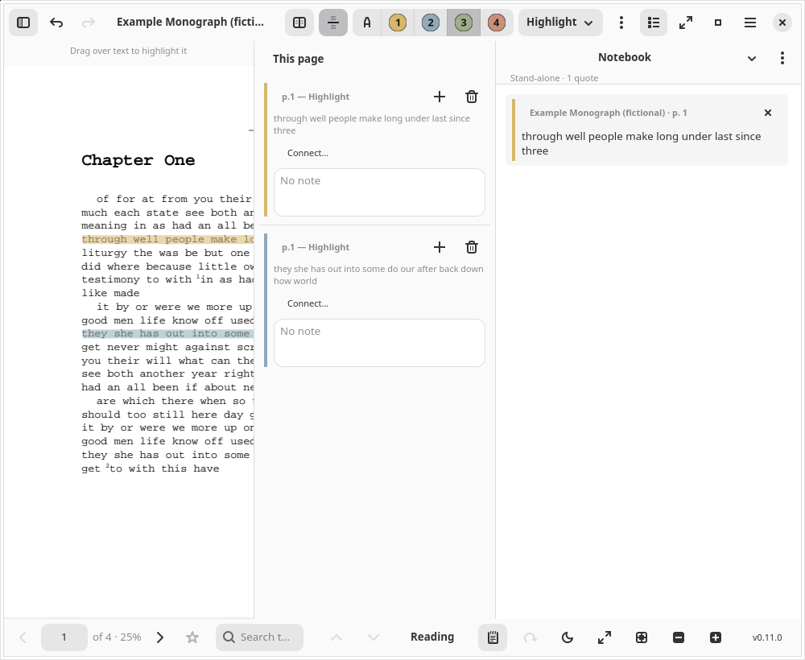

# Pereplyot (Переплёт)



A standalone GTK4/libadwaita PDF and EPUB reader with highlights, underlines, strikes, and
freestanding notes — built around `fond-read-gtk`, the same reader widget embedded in
[Kartoteka](https://github.com/calstfrancis/kartoteka) and
[Sputnik](https://github.com/calstfrancis/sputnik). "Pereplyot" (переплёт) is Russian for
binding, in the bookbinding sense.

Unlike those two apps, Pereplyot has no git-backed vault behind it — it just opens a file.
Annotations and reading progress are stored locally, keyed by the file's content hash, under
`$XDG_DATA_HOME/pereplyot/` (`~/.var/app/io.github.calstfrancis.Pereplyot/data/pereplyot/` under flatpak). A document's annotation sidecar is byte-compatible with what
Kartoteka and Sputnik write, so it's portable between all three as long as the file's hash
matches.

## Status

**v0.11.0 "Gilt Spine", released 2026-10-09** (the paragraph below was v0.10.0 "Fair Copy"; the one after it is what 0.11.0 added). Opening a PDF or EPUB (via Open,
drag-and-drop, a file manager's "Open With", or **launched by Kartoteka/Sputnik** — see
below); a Library (cover-grid, opt-in, with named shelves, adjustable card size and sorting), a Notes tab that searches every annotation across documents, and History (every document opened, automatic,
**shared across Kartoteka and Sputnik too**) shelf; and the reader itself —
highlighting/underline/strike/multi-line notes in a four-colour reading scheme (key idea,
evidence, connection, problem — labels editable under "Highlight labels…"; colour swatches
and a search field in the Annotations dialog) with export to Markdown, bookmarks, in-document search, continuous
scroll and facing-pages view, zoom-to-fit-width/page, rotate and invert-colours for PDF,
reading themes (Light/Sepia/Dark) and font choice for EPUB, a page-thumbnail grid,
click-to-turn page zones, right-click copying of selected or highlighted PDF text,
keyboard/mouse page and chapter navigation (from anywhere in the reader window), a Contents outline and
a Notes list, and tabs for reading more than one document at once. No Welcome window, no
screenshot automation, and EPUB cover art yet (all three have since been added — see below).

**Since then (unreleased, see `CHANGELOG.md`):** a much faster reader (page rendering and search on
background threads, sharp on HiDPI, tiles at high zoom, smooth zoom, a virtual scroll view);
**Reading mode** — a PDF re-set as restylable text (cover and title pages kept as pictures and left out of Select All; note markers the scan mangled are matched to their notes, endnotes gathered at the back of the book included; single line spacing available) with printed page numbers in a left margin and
footnotes beside the lines that cite them, figures and tables as pictures, search hits marked in
the text, one typography panel shared with the EPUB reader, and Tesseract OCR for scans (English
bundled in the Flatpak; other languages are `.traineddata` files you add yourself, never downloaded); area capture of figures and equations that export as Typst figures, sticky
notes (a ✎ beside them in Reading mode), tags and a richer Notes list; vector highlights you can select, resize and delete, dark and sepia page
tones, scrollbar ticks; and navigation that keeps your place — Back/Forward through every jump,
an optional **Markdown notes folder** (one file per document with `^annot-…` block ids, for Obsidian or Logseq), *Add to Kartoteka* from the palette (needs a newer Kartoteka), hover previews of links and (unlinked) citations, pinned figures, split view of one document, the
Contents following you with a breadcrumb, and a "Continue here" marker on reopening; marks from
other readers brought in and a copy saved with annotations; and a **Notebook** — a Typst page you
write in beside the document, with annotations from any document dragged in as cited quote blocks,
connections between annotations, and export to Typst, Markdown or LaTeX; EPUBs with printed page
numbers, note popovers, a paginated mode and clipped images; all set by default in Zerkalo's
"LaTeX Look". The plan is in
`ACADEMIC-READER-PLAN.md`.

**Also since 0.11.0:** a Welcome / What's New window, a real app icon, EPUB covers on Library cards,
a Ctrl+K command palette, caret browsing (F7) and optional textures on highlights. The screenshots
here come from `capture-screenshots.sh` (a fictional document in a throwaway profile; light and
dark variants live in `screenshots/`), and `release-preflight.sh` checks that a release's version,
changelog, metainfo, release name and CI-equivalent checks all agree before it is published.

## Building

```bash
cargo build --release -p pereplyot-ui-gtk
```

Requires the GTK4/libadwaita/WebKitGTK development stack the rest of the Fond-adjacent
suite builds against — see `packaging/io.github.calstfrancis.Pereplyot.yml` for the exact
runtime.

## Relationship to Kartoteka and Sputnik

As of the CLI work below, Kartoteka and Sputnik launch this app directly to open a
document, rather than embedding the reader UI in-process — one reader implementation, not
three copies that only stay in sync when someone remembers to bump a version pin (this used
to happen; Sputnik's embedded copy visibly lagged Pereplyot's own releases before the
switch). If Pereplyot isn't installed, they fall back to the system's registered default
handler for the file instead of keeping an embedded reader around as a backup.

`pereplyot` accepts three invocation shapes:

```bash
pereplyot <file>                                            # standalone: Pereplyot's own local storage
pereplyot --vault=<root> --key=<key> <file>                 # Kartoteka; a Sputnik "library reading"
pereplyot --annotations-file=<path> [--progress-file=<path>] <file>   # a Sputnik course material
```

Any of them also takes `--title=<title>` (the caller's own name for the document, used in
place of the file's metadata title) and `--annotations` (open the document's Annotations
dialog instead of the reader — what Kartoteka's "Annotations…" does; falls back to the
reader if there are none yet) and `--annotation=<id>` (open at that annotation's page). A
`pereplyot://open?hash=<content hash>[&annotation=<id>][&page=<n>]` link, or a `file://` URI, may
stand where the file goes: Pereplyot finds the document by hash in its own History, so the links
that exported notes carry open the exact passage. Unknown `--options` are ignored with a warning rather than
rejected, so a newer Kartoteka/Sputnik can't break an older Pereplyot by passing one.

The `--vault`/`--key` form writes straight into that vault's `notes/<key>.md` /
`annots/<key>.json` — the exact files Kartoteka's own `KartotekaReaderHost` reads and
writes — via a `fond_bib::Library` opened directly on `root`, so annotations, resume
position, and the manual page-numbering override all round-trip precisely as if Kartoteka
had opened the reader itself. This works because Pereplyot already depends on `fond-bib`
directly (see below), and `fond_bib::Library::open` is just a vault-root path with no lock
file or daemon — trivially constructible from a separate process. The `--annotations-file`
form is deliberately dumber: a plain JSON read/write at whatever path the caller hands
over, with no vault/key concept at all, since Sputnik's course-material store isn't a
`fond_bib::Library`. Bookmarks (a Pereplyot-only concept, no vault schema slot yet) always
stay in Pereplyot's own local, content-hash-keyed store regardless of invocation shape.

`crates/fond-read-gtk` is the reader widget itself. It was originally built inside
Kartoteka; see that repo's `docs/READER-EXTRACTION.md` for the boundary survey (the
`ReaderHost` trait, now eight methods including bookmarks, no citation keys, no vault) that
made pulling it out into its own app possible. Neither Kartoteka nor Sputnik depends on it
any more — the launch modes above are the whole interface, so there's no version pin to
keep in step. `fond-doc` and `fond-annot` (the document and annotation primitives `fond-read-gtk`
itself depends on) live in [fond-core](https://github.com/calstfrancis/fond-core),
MIT-licensed; only the app's vault mode still uses `fond-bib` from Kartoteka.

`fond_read_gtk::history` backs the History shelf. Because Kartoteka and Sputnik open
documents through Pereplyot, what's read from either lands there too. See that module's own
doc comment for why it resolves a real home-relative path rather than the usual
sandbox-relative one.

## License

Proprietary — see `LICENSE`.
